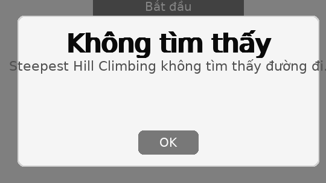

# PHAN ĐÌNH DUẨN - 23110192

# Đồ án 8-puzzle giải quyết với các thuật toán tìm kiếm

Một ứng dụng desktop được xây dựng bằng Pygame để mô phỏng và giải bài toán 8-puzzle sử dụng nhiều thuật toán tìm kiếm khác nhau, bao gồm cả các thuật toán cơ bản và nâng cao, cũng như các biến thể ứng dụng khái niệm And-Or Tree cho phép "di chuyển kép".

## 1. Mục tiêu

- Ứng dụng các thuật toán tìm kiếm trong trí tuệ nhân tạo (AI) để giải bài toán 8-Puzzle — một bài toán kinh điển về tìm kiếm trạng thái.
- Trực quan hóa quá trình giải quyết bài toán theo từng thuật toán bằng giao diện đồ họa Pygame.
- Đánh giá, so sánh hiệu suất của các thuật toán qua các chỉ số như số node đã duyệt và thời gian tìm kiếm.
- Làm nền tảng cho các bài toán phức tạp hơn về lĩnh vực trí tuệ nhân tạo (AI) sau này

## 2. Nội dung

Dự án bao gồm:

- Giao diện đồ họa được xây dựng bằng Pygame, dễ dàng tương tác và thực hiện các tính năng.
- Các thuật toán tìm kiếm từ các nhóm tìm kiếm không thông tin, có thông tin, tìm kiếm cục bộ, giải quyết CSP, tìm kiếm trong môi trường phức tạp và học tăng cường.
- Hỗ trợ "Di Chuyển Kép" (Ứng dụng And-Or Tree): Nhiều thuật toán có phiên bản "ANDOR" hoặc "Double Moves", mô phỏng việc ô trống có thể thực hiện một hoặc hai bước di chuyển hợp lệ trong một lượt, coi như một ứng dụng của cây And-Or trong không gian trạng thái.
- Chức năng hoạt họa quá trình giải theo đường đi tìm được bởi thuật toán.
- Tùy chỉnh được trạng thái ban đầu của puzzle.
- Dễ dàng chọn và chạy các thuật toán khác nhau để quan sát hiệu quả.

### 2.1. Nhóm thuật toán tìm kiếm không có thông tin

Tìm kiếm không thông tin là nhóm thuật toán không sử dụng bất kỳ kiến thức bổ sung nào về khoảng cách hay vị trí tương đối của trạng thái hiện tại so với trạng thái mục tiêu. Chúng hoạt động dựa trên:

- Cấu trúc không gian trạng thái đã được định ghãi.
- Các phép biến đổi trạng thái hợp lệ để sinh ra các trạng thái mới.

**Các thuật toán áp dụng**

- **Breadth-First Search (BFS):** Duyệt theo chiều rộng, đảm bảo tìm ra đường đi ngắn nhất về số bước.

  - `BFS` (Di chuyển đơn)
  - `BFS (Double Moves)` / `bfs_ANDOR`

- **Depth-First Search (DFS):** Duyệt theo chiều sâu, có thể tìm ra giải pháp nhanh nhưng không đảm bảo tối ưu.

  - `DFS` (Di chuyển đơn)
  - `DFS (Double Moves)` / `dfs_ANDOR`

- **Iterative Deepening DFS (IDDFS):** Kết hợp ưu điểm của BFS (tối ưu) và DFS (không gian bộ nhớ).
  - `IDDFS` (Di chuyển đơn)
  - `IDDFS (Double Moves)` / `iddfs_ANDOR`
- **Uniform-Cost Search (UCS):** Tìm đường đi với chi phí thấp nhất (khi các hành động có chi phí khác nhau).
  - `UCS` (Di chuyển đơn, chi phí mỗi bước là 1)
  - `UCS (Double Moves)` / `ucs_ANDOR` (Di chuyển đơn chi phí 1, di chuyển kép chi phí 2)

**Hình ảnh hiệu suất**

**Nhận xét**
- Thuật toán khi có kết hợp với cây AND-OR sẽ cho ra hiệu suất có vẻ cao hơn so với thường.
- Hiệu quả tổng thể: BFS (Double Moves) và IDDFS (Double Moves) nổi bật với số node duyệt ít (5), thời gian nhanh (0.001-0.002 s), phù hợp cho bài toán nhỏ hoặc yêu cầu đường đi ngắn nhất.
- Kém hiệu quả nhất: DFS (tiêu chuẩn) kém nhất khi duyệt tới 64583 node, thời gian dài (0.161 s), không hiệu quả cho không gian tìm kiếm lớn.
- Ổn định: UCS và BFS (tiêu chuẩn) có hiệu suất tốt, thời gian nhanh (0.001 s) với số node vừa phải (9), phù hợp cho bài toán cần đường đi tối ưu.
- Khuyến nghị: Ưu tiên BFS hoặc IDDFS (Double Moves) cho bài toán nhỏ, trong khi DFS nên tránh với không gian tìm kiếm lớn.

### 2.2. Nhóm thuật toán tìm kiếm có thông tin

Tìm kiếm có thông tin sử dụng thêm kiến thức về bài toán, dưới dạng hàm heuristic, để ước lượng khoảng cách từ trạng thái hiện tại đến mục tiêu. Điều này giúp quá trình tìm kiếm hiệu quả hơn bằng cách ưu tiên mở rộng các trạng thái "có triển vọng".

**Các thuật toán áp dụng**

- **Greedy Best-First Search:** Luôn ưu tiên mở rộng nút có vẻ "gần" đích nhất theo heuristic.

  - `Greedy Search` (Di chuyển đơn)
  - `Greedy Search (Double Moves)` / `greedy_ANDOR`

- **A\* Search:** Kết hợp chi phí thực tế đã đi (g) và chi phí ước lượng còn lại (h) để tìm đường đi tối ưu về tổng chi phí.

  - `A* Search` (Di chuyển đơn, sử dụng heuristic Manhattan)
  - `A* Search (Double Moves)` / `a_star_ANDOR` (Sử dụng heuristic Manhattan, di chuyển kép có chi phí cao hơn)

- **Iterative Deepening A* (IDA*):** Tương tự IDDFS nhưng sử dụng hàm f(n) = g(n) + h(n) làm giới hạn.
  - `IDA* Search` (Di chuyển đơn)
  - `IDA* (Double Moves)` / `ida_star_ANDOR`

**Hình ảnh hiệu suất**

**Nhận xét**
- Tương tự như nhóm trên, thuật toán kết hợp với AND-OR Search Tree cho ra kết quả hiệu quả hơn.
- Hiệu quả cao nhất: A* (Double Moves) và IDA* (Double Moves) vượt trội với 5 node và thời gian 0.000 s.
- Hiệu quả thấp hơn: Greedy Search (27 node) tiêu tốn nhiều tài nguyên hơn.
- Khuyến nghị: Ưu tiên A* hoặc IDA* (Double Moves) cho bài toán nhỏ và cần tối ưu. Tránh Greedy Search nếu không gian tìm kiếm lớn.

### 2.3. Các thuật toán Tìm kiếm cục bộ

Tìm kiếm cục bộ là nhóm thuật toán tối ưu hóa mà không duyệt toàn bộ cây trạng thái, mà chỉ tập trung vào một hoặc vài trạng thái hiện tại, cố gắng cải thiện dần lời giải thông qua các phép biến đổi nhỏ.

**Các thuật toán áp dụng**

- **Hill Climbing:**
  - `Simple Hill Climbing`: Di chuyển đến lân cận tốt hơn đầu tiên tìm thấy (trong project này, logic có thể chọn ngẫu nhiên trong các bước cải thiện).
    - `Hill Climbing` (Di chuyển đơn)
    - `Hill Climbing (Double Moves)` / `hill_climbing_ANDOR`
  - `Steepest Ascent Hill Climbing`: Di chuyển đến lân cận _tốt nhất_ trong số tất cả các lân cận.
    - `Steepest Ascent Hill Climbing` (Di chuyển đơn)
    - `Steepest Ascent Hill Climbing (Double Moves)` / `steepest_hill_ANDOR`
  - `Stochastic Hill Climbing`: Chọn một lân cận tốt hơn một cách ngẫu nhiên từ các lân cận cải thiện.
    - `Stochastic Hill Climbing` (Di chuyển đơn)
    - `Stochastic Hill Climbing (Double Moves)` / `stochastic_hc_ANDOR` (_Chính xác là stochastic_hill_ANDOR.py_)
- **Local Beam Search:** Giữ lại một số lượng (`beam_width`) các trạng thái tốt nhất ở mỗi bước để khám phá song song.
  - `Beam Search` (Di chuyển đơn)
  - `Beam Search (Double Moves)` / `beam_search_ANDOR`
- **Simulated Annealing:** Cho phép di chuyển đến trạng thái xấu hơn với một xác suất nhất định (giảm dần theo "nhiệt độ") để thoát khỏi cực trị địa phương.
  - `Simulated Annealing` (Di chuyển đơn)
  - `Simulated Annealing (Double Moves)` / `simulated_annealing_ANDOR`
- **Genetic Aglorithm** Một phương pháp để giải quyết cả bài toán tối ưu hóa có ràng buộc và không ràng buộc dựa trên chọn lọc tự nhiên.
  - `Genetic Algorithm` (Di chuyển đơn)
  - `Genetic Algorithm (Double Moves)` / `genetic_ANDOR`

**Hình ảnh hiệu suất**

**Nhận xét**
- Hiệu quả cao nhất: Steepest Hill Climbing (Double Moves), Hill Climbing (Double Moves), và Beam Search (Double Moves) nổi bật với 5 node và thời gian 0.000-0.001 s, rất phù hợp cho bài toán nhỏ.
- Hiệu quả thấp nhất: Stochastic Hill Climbing (554 node) và các thuật toán không tìm thấy đường đi (Hill Climbing, Steepest Hill Climbing, Simulated Annealing) kém hiệu quả (đối với trạng thái ban đầu này thì không tìm thấy đường đi)
- Khuyến nghị: Ưu tiên Steepest Hill Climbing (Double Moves) hoặc Hill Climbing (Double Moves) cho bài toán nhỏ cần hiệu suất cao. Tránh Simulated Annealing và các biến thể không Double Moves do không tìm được giải pháp.

### 2.4. Các thuật toán Tìm kiếm trong môi trường phức tạp

- **Searching with No Observation (Blind Belief Search):**
  - Triển khai trong `blind.py`. Agent không biết chắc chắn trạng thái hiện tại của mình mà duy trì một "belief state" (tập hợp các trạng thái có thể). Mục tiêu là tìm một chuỗi hành động chung để đưa tất cả các trạng thái trong belief state về một trong các trạng thái đích. Đây là một ví dụ về tìm kiếm trong không gian belief state, sử dụng BFS trên các belief state.

### 2.5. Giải Quyết Vấn Đề Thỏa Mãn Ràng Buộc (CSP)

- Việc điền số vào lưới 8-puzzle được xem như một dạng CSP.
  - **Backtracking Search:** Sử dụng trong tính năng "Hoạt ảnh Điền Số" (`fill.py`) để tìm một cách điền các số từ 1-9 vào lưới sao cho thỏa mãn trạng thái đích. Thuật toán thử các giá trị và quay lui nếu gặp ngõ cụt.

### 2.6. Học tăng cường

- Agent học cách hành động tối ưu thông qua tương tác với môi trường và nhận phản hồi (reward/penalty).\*
  - **Q-Learning:** Triển khai trong `q_learning.py`. Agent xây dựng một bảng Q-table để ước lượng giá trị của việc thực hiện một hành động tại một trạng thái cụ thể. Cần quá trình "huấn luyện" để bảng Q-table hội tụ.

**Hiệu suất**

**Nhận xét**
- Thuật toán QLearning duyệt một số lượng rất lớn node (119704), nhưng chỉ cần 9 bước để tìm đường đi tối ưu, với thời gian 0.498 s. Điều này cho thấy QLearning hiệu quả trong việc học và tối ưu hóa đường đi sau khi xử lý nhiều trạng thái, nhưng tiêu tốn nhiều tài nguyên tính toán.
- Phù hợp cho bài toán học tăng cường (reinforcement learning) với dữ liệu lớn, nhưng không tối ưu nếu yêu cầu tốc độ cao hoặc không gian tìm kiếm nhỏ.

---

**Giải thích về "Di Chuyển Kép" / Ứng dụng And-Or Tree:**
Các thuật toán có hậu tố `_ANDOR` hoặc được mô tả là `(Double Moves)` trong giao diện không chỉ xem xét việc di chuyển ô trống một bước (`OR-node` truyền thống) mà còn xem xét khả năng di chuyển ô trống hai bước liên tiếp như một "hành động" đơn lẻ phức tạp hơn.
Điều này có thể được coi là một ứng dụng của khái niệm cây And-Or (And-Or graph search) trong không gian trạng thái, nơi một "hành động" (AND-node) có thể bao gồm một chuỗi các hành động con (OR-nodes cho mỗi bước di chuyển cơ bản).
Mục tiêu là tìm ra một "chiến lược" di chuyển (có thể bao gồm cả bước đơn và bước kép) để đến đích. Trong các thuật toán như UCS và A\*, các "hành động kép" này thường được gán chi phí cao hơn (ví dụ: chi phí 2) so với hành động đơn (chi phí 1). Điều này cho phép các thuật toán đánh giá và lựa chọn giữa việc thực hiện một bước dài hơn (tiềm năng giảm số lượt) với chi phí cao hơn, hoặc nhiều bước ngắn hơn với chi phí thấp hơn trên mỗi bước.

---

## 3. Kết luận

- Nắm bắt và hiểu được nguyên lí hoạt động của các thuật toán tìm kiếm vào trong không gian trạng thái, là nền tảng để giải quyết các vấn đề phức tạp. Việc áp dụng các thuật toán tìm kiếm vào 8-puzzle giúp hiểu rõ các ưu nhược điểm và mức độ hiệu quả của từng thuật toán. Từ đó nhận thức được tầm quan trọng của việc dùng thuật toán nào phù hợp với từng loại bài toán cụ thể.
- Giao diện trực quan giúp người dùng dễ dàng tương tác và theo dõi quá trình giải đố. Đồng thời giúp người thực hiện dễ dàng kiểm tra và hoàn thiện bài hiệu quả hơn.
